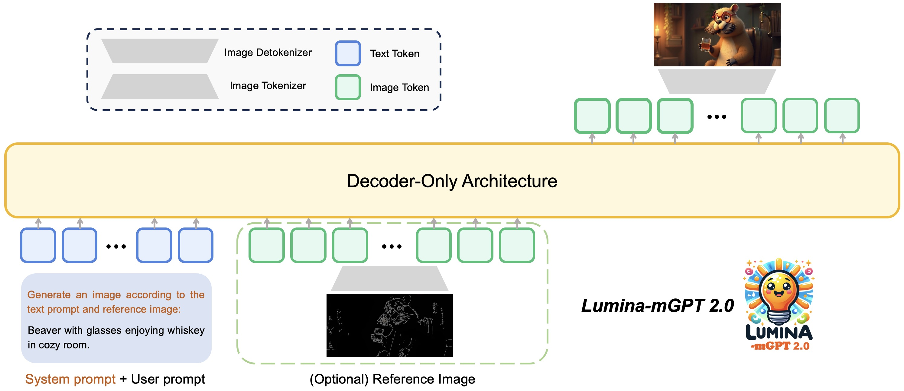
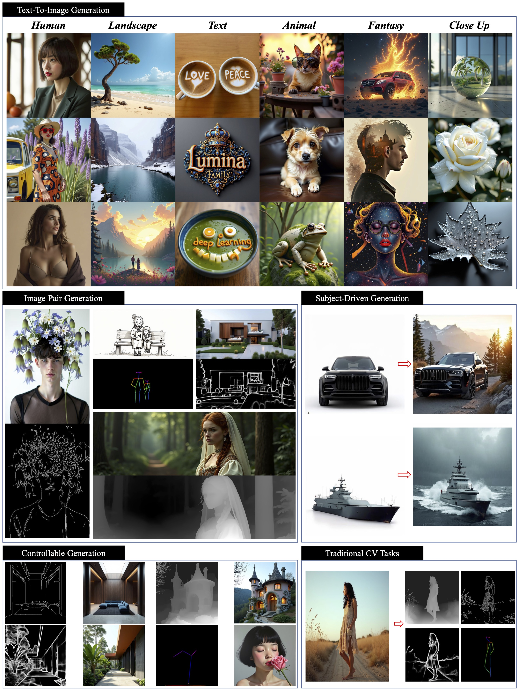

<p align="center">
 
 <br>
</p>

<div align="center">
<h1> Lumina-mGPT 2.0: Stand-alone Autoregressive Image Modeling </h1>

<b>¹Shanghai AI Laboratory, &nbsp;  ²SII, &nbsp; ³CUHK, &nbsp;⁴ZJUT</b>

</div>

## 📚 Introduction 
We introduce a stand-alone, decoder-only autoregressive model, **trained from scratch**, that unifies a broad spectrum of image generation tasks, including **text-to-image generation, image pair generation, subject-driven generation, multi-turn image editing, controllable generation, and dense prediction**.

<details open>
  <summary>User Demo</summary>
  <video src="https://github.com/user-attachments/assets/7b87eeac-3f20-450c-8df0-a45218acc51d" width="100%"/></video>
</details>
   
<details open>
  <summary>Architecture</summary>
  
</details>


## 🔥 News
**[2025-04-03]** 🎉🎉🎉 Lumina-mGPT 2.0 is released! 🎉🎉🎉


## 📝 Open-source Plan
 - [x] Text-to-Image / Image Pair Generation Inference & Checkpoints
 - [x] Finetuning code
 - [ ] All-In-One Inference & Checkpoints
 - [ ] Technical Report

## 📽️ Demo Examples
<details open>
  <summary>Qualitative Performance</summary>
 
</details>

<details open>
  <summary>Comparison with Lumina-mGPT and Janus Pro</summary>
  
</details>


## 🚀 Quick Start
### ⚙️ Installation
#### 1. Create a conda environment
```
git clone https://github.com/Alpha-VLLM/Lumina-mGPT-2.0.git && cd Lumina-mGPT-2.0
conda create -n lumina_mgpt_2 python=3.10 -y
conda activate lumina_mgpt_2
```
#### 2. Install  dependencies
```
pip install -r requirements.txt
pip install https://github.com/Dao-AILab/flash-attention/releases/download/v2.7.4.post1/flash_attn-2.7.4.post1+cu12torch2.3cxx11abiFALSE-cp310-cp310-linux_x86_64.whl --no-build-isolation
pip install -e .
```
> Kindly find proper flash-attn version from this [link](https://github.com/Dao-AILab/flash-attention/releases).
#### 3. Download MoVQGAN
Download MoVQGAN weights and put them to the ```lumina_mgpt/movqgan/270M/movqgan_270M.ckpt```.
```
mkdir -p lumina_mgpt/movqgan/270M
wget -O lumina_mgpt/movqgan/270M/movqgan_270M.ckpt https://huggingface.co/ai-forever/MoVQGAN/resolve/main/movqgan_270M.ckpt
```

### ⛽ Inference
#### 1. Simple Inference
```
python generate_examples/generate.py \
--model_path Alpha-VLLM/Lumina-mGPT-2.0 --save_path save_samples/ \
--cfg 4.0 --top_k 4096 --temperature 1.0 --width 768 --height 768
```

#### 2. Accelerate Inference
Provide two acceleration strategies: Speculative Jacobi Decoding (```--speculative_jacobi```) and Model Quantization (```--quant```).
```
python generate_examples/generate.py \
--model_path Alpha-VLLM/Lumina-mGPT-2.0 --save_path save_samples/ \
--cfg 4.0 --top_k 4096 --temperature 1.0 --width 768 --height 768 \
--speculative_jacobi --quant
```

We provide the inference time and GPU memory on one A100 as a reference:
| Method               | Inference Time | Inference GPU Memory | Description |
|----------------------|--------|--------|--------------------|
| Lumina-mGPT 2.0      | 694s   | 80 GB  | ✅ Recommend |
| + speculative_jacobi | 324s     | 79.2 GB  | ✅ Recommend |
| + speculative_jacobi & quant | 304s     | 33.8 GB  |  |

### 💻 Finetuning
Please refer to  [TRAIN.md](TRAIN.md)


## 🤗 Checkpoints
| Model                | Size | Reso | pth link | Description |
|----------------------|--------|--------|--------------------|--------------------|
| Lumina-mGPT 2.0      | 7B     | 768px  | [7B_768px](https://huggingface.co/Alpha-VLLM/Lumina-mGPT-2.0)       | Text-to-Image & Image Pair Generation |

## 🌟 Acknowledgements

**Thanks to the following open-sourced codebase for their wonderful work and codebase!**
- [Lumina-mGPT: Illuminate Flexible Photorealistic Text-to-Image Generation with Multimodal Generative Pretraining](https://github.com/Alpha-VLLM/Lumina-mGPT)
- [Accelerating Auto-regressive Text-to-Image Generation with Training-free Speculative Jacobi Decoding](https://github.com/tyshiwo1/Accelerating-T2I-AR-with-SJD/)
- [Chameleon: Mixed-Modal Early-Fusion Foundation Models](https://github.com/facebookresearch/chameleon)

## 📖 BibTeX

```
@misc{lumina-mgpt-2.0,
      title={Lumina-mGPT 2.0: Stand-Alone AutoRegressive Generative Image Modeling},
      author={AlphaVLLM Team},
      year={2025},
      url={https://github.com/Alpha-VLLM/Lumina-mGPT-2.0},
}
```


